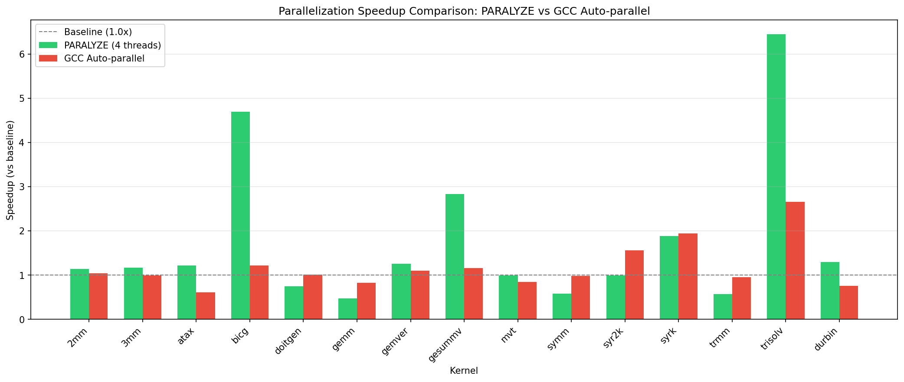

# PARALYZE

Automatic loop parallelization with transparent static analysis and OpenMP pragma generation.

---

## Motivation

Automatic parallelization has been a long-standing challenge in compiler optimization. While tools like GCC's `-ftree-parallelize-loops` exist, they tend to be overly conservative and often parallelize almost nothing on real-world code.

The goal with **PARALYZE** was to build something more aggressive and transparent. GCC does dependency analysis (loop-carried dependencies, array conflicts, function side effects) but treats it as binary: either 100% provably safe or don't touch it. I tested it on 15 PolyBench kernels and it found very few opportunities.

This tool does the same kind of analyses but uses confidence scoring instead of binary decisions. A loop that's 75% safe gets parallelized, with the score shown so you understand the risk. GCC would reject that same loop. The result: more loops parallelized where it makes sense, and you can actually why instead of being buried under heuristics. The speedups come from being willing to parallelize "pretty safe" loops, not just "perfectly safe" ones.

## Results

Tested on PolyBench linear algebra kernels (4 threads):



6 out of 15 got real speedup (>1.5x). Best was 6.45x on triangular solver.

GCC's auto-parallelizer did basically nothing on the same code.

---

## Usage

### Basic Analysis

```bash
./build/paralyze input.c
```

Shows which loops can be parallelized:


### Verbose Mode

```bash
./build/paralyze --verbose input.c
```

Shows detailed dependency analysis:


### Generate OpenMP Code

```bash
./build/paralyze --generate-pragmas input.c
```

Creates `input_openmp.c` with OpenMP pragmas:


Compile it:
```bash
clang -O3 -fopenmp input_openmp.c -o output
```

Add `--verbose` to see the reasoning:
```bash
./build/paralyze --generate-pragmas --verbose input.c
```


---

## How It Works

Uses Clang to parse C into an AST, then checks each loop for dependencies:

**Scalar variables** - if a variable is written in iteration N and read in N+1, that's a dependency  
**Arrays** - `A[i]` in iteration `i` is safe, `A[i-1]` creates a dependency  
**Pointers** - complex pointer arithmetic gets flagged as unsafe  
**Function calls** - math functions are safe, everything else assumed risky

Assigns each loop a confidence score (0-100%). Higher = safer to parallelize.

**Only parallelizes outer loops** - inner loops run normally inside each thread. Nested parallelism just adds overhead.

---

## Analysis Pipeline

```
C Source Code
    ↓
Clang AST Parser
    ↓
Loop Detection & Bounds Analysis
    ↓
Dependency Analysis
    ├─ Scalar Variables
    ├─ Array Accesses
    ├─ Pointer Operations
    └─ Function Calls
    ↓
Parallelization Decision (with confidence score)
    ↓
OpenMP Pragma Generation
    ↓
Annotated Source Code
```

---

## Benchmark Details

15 PolyBench linear algebra kernels, 4 threads:


Vector operations (dot product, axpy) parallelized well. Triangular solver got 6.45x.

Matrix operations had thread overhead issues - spawning costs more than the work for small loops.

GCC's auto-parallelizer found almost nothing. It bails on pointer uncertainty even when it's safe.

---

## Limitations

For small loops, spawning threads costs more than the actual work. Saw this in matrix multiplication benchmarks.

PolyBench uses macros that turn arrays into pointers. Can't see through macros, so some dependencies get missed.

Complex pointer operations get flagged as unsafe even when they're probably fine. Better safe than introducing race conditions though.

---

## Building

### Requirements
- Clang/LLVM 15+
- CMake 3.15+
- C++17 compiler
- gcc-15 (for benchmark comparisons)

### Build

```bash
git clone https://github.com/ayokunle321/paralyze.git
cd paralyze
mkdir build && cd build
cmake ..
make -j$(nproc)
```

Binary: `build/paralyze`

---

## Project Structure

```
paralyze/
├── include/analyzer/
│   ├── ASTVisitor.h              
│   ├── LoopVisitor.h             # Loop detection
│   ├── DependencyAnalyzer.h      # Dependency checks
│   ├── ArrayDependencyAnalyzer.h
│   ├── PointerAnalyzer.h
│   ├── FunctionCallAnalyzer.h
│   ├── PragmaGenerator.h         # OpenMP generation
│   └── SourceAnnotator.h         # Code annotation
├── src/                          # Implementations
├── benchmarks/
│   ├── scripts/                  # Benchmark runners
│   └── results/                  # Performance data
└── README.md
```

---

## Future Work

- C++ support (templates, classes)
- Cost model to predict when thread overhead kills performance
- Better array dependency analysis
- Let users tune how aggressive it should be

---

## Contact

**ayokunle321@gmail.com** or open an issue on GitHub
